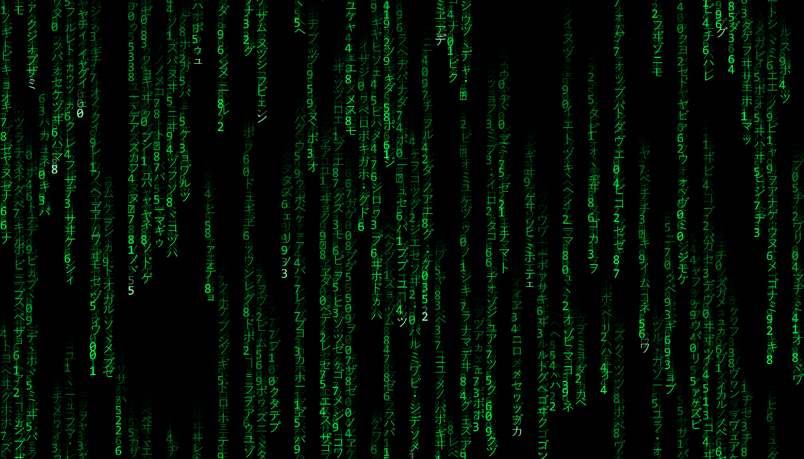
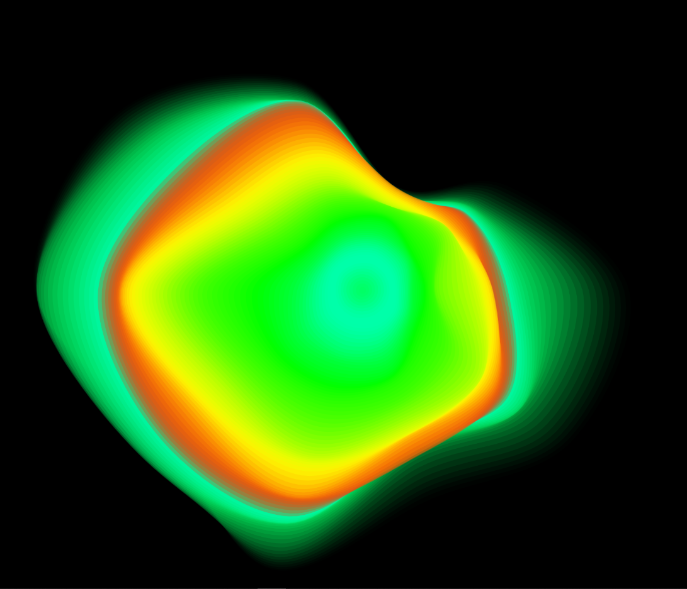
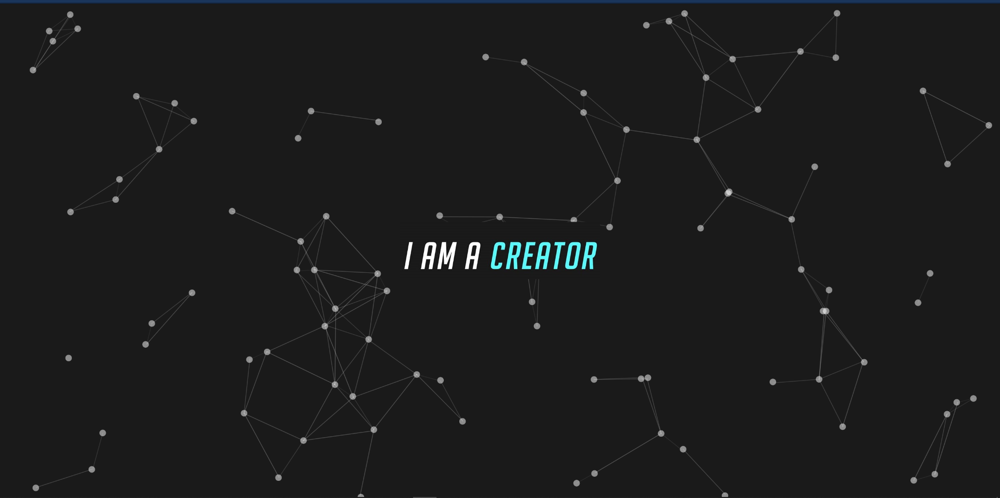
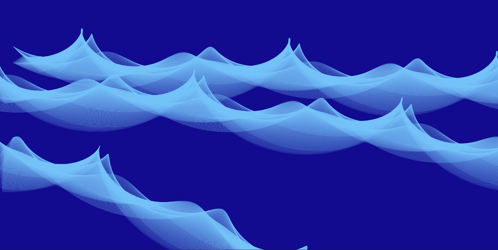
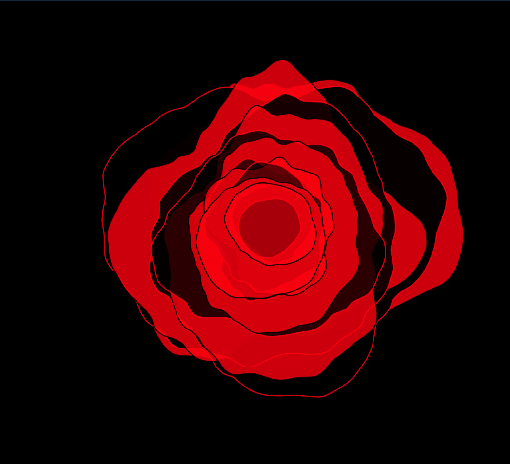
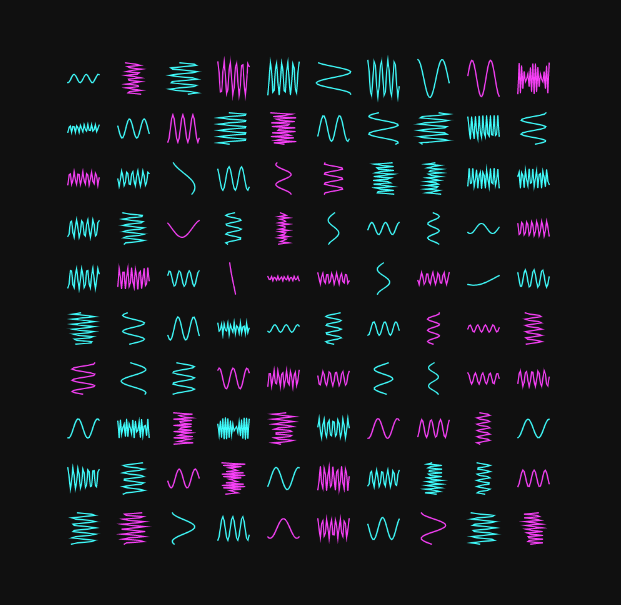
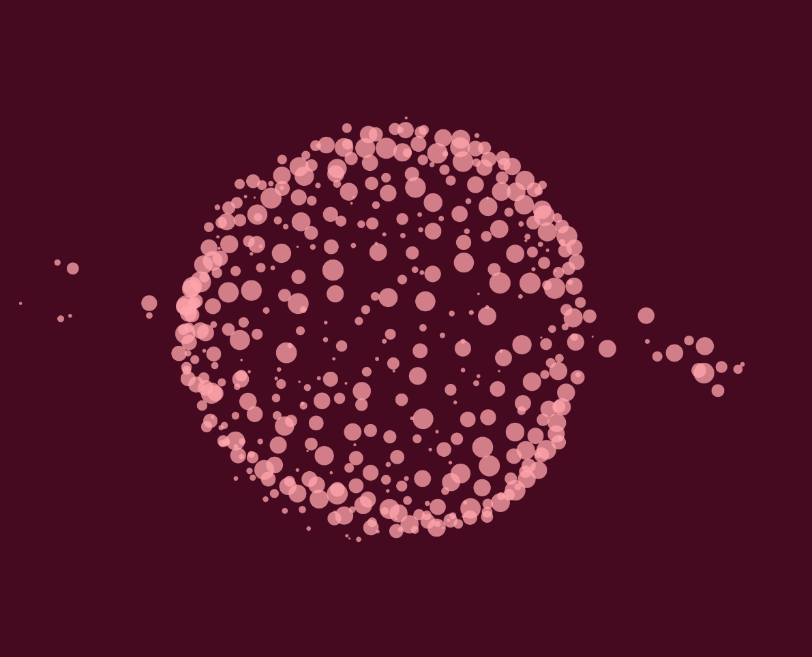
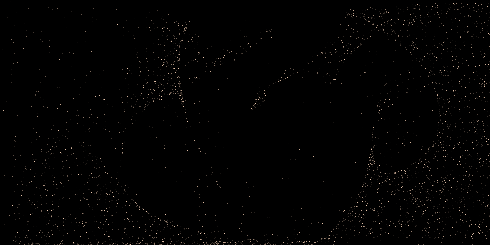

# ***Creative-Coding***

## *These are some of the mini-projects that I did during learning about p5.js. All of them are animations but I am uploading their screenshots. Let's check them out one by one.*

<ins> ***Make sure you have live server on your VSCode or Atom for easy viewing*** </ins>

**1. MATRIX** - *Classic green screen scene from the movie MATRIX, tried to be as accurate to the original inspiration*

**2.NOISE SHAPE** - *This is basically a moving blob with cool colors, Will make you absolutely fall in love with the effects one can acheive with noise and randomness. There are actually two different variation so make sure to edit the script path and check them both out.*

**3.PARTICLES** - *This is probably one of the easiest effect to acheive but introduces to the concept of particle physics like collisions and using properties like distance between the particles to give a basic styling effect.*

**4.PERFECT BLUE** - *This just shows how beautiful co-ordinate geometry can be. Here we are moving 3 different triangles to create smooth flowing curves.*

**5.ROSE** - *This has 2 completely different approach to create a closest looking thing to a Rose. The First part is approximately same as the previous project NOISE SHAPE. The second uses bezir curves to acheive the effect.*

**6.WAVES** - *A simple cosine waves with a slight variation in the different properties such as the phase constant, damping coefficient, amplitude, Time period among other more.*

## **SOME MORE**

**Visualization of Gravitation Force:-** *Use mouse press to add particles***

**Visualization of Concepts of Inertia and Attractive Forces:-** *Mouse press and drag to move particles*

